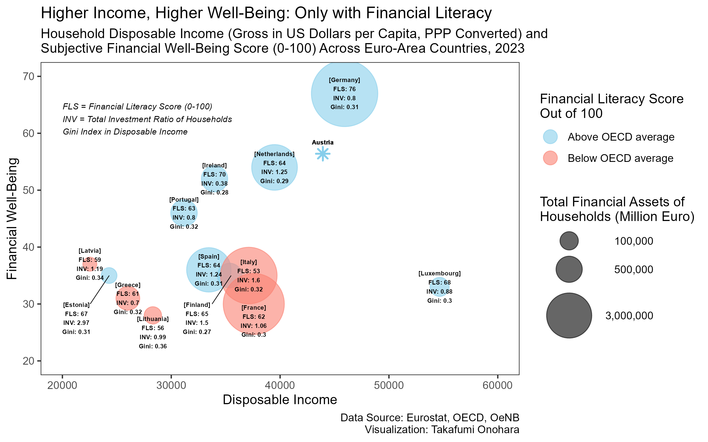

# Introduction

Financial well-being reflects more than income or macroeconomic conditions. It is also shaped by individual preferences, particularly in relation to risk aversion. Earlier work by @guiso_sapienza_zingales_2006_culture shows that risk attitudes can be rooted in cultural factors, such as how children grow up learning about thrift and the value of saving. More recent evidence by @oehler_horn_wendt_2024_finlit_risky_assets highlights the role of financial literacy in reducing excessive risk aversion and shaping how people perceive and manage financial risks. This would imply that financial literacy can help correct distorted risk attitudes formed early in life and encourage more rational financial behavior in adulthood.

Low financial literacy can limit households in making effective use of their assets, especially through underdiversification and limited participation in risky markets. Evidence from @calvet_campbell_sodini_2007_down_or_out shows that many households either avoid risky assets altogether or hold portfolios that are too concentrated, which reduces the gains they could obtain from financial markets. Even when households do invest, inefficient choices can generate meaningful return losses relative to well‑diversified benchmarks. Financial literacy could help correct these inefficiencies by improving understanding of risk–return trade-offs and the value of diversification, allowing households to engage with financial markets in ways that better support long‑term wealth accumulation and financial well-being.

# Research Question

This report addresses whether financial literacy matters in shaping the supposed virtuous transition from income to wealth and ultimately to subjective financial well-being across euro-area countries. Does financial literacy influence how effectively higher income translates into stronger asset positions and higher financial well-being? In this context, “financial literacy,” as stated by the @oecd_infe_finlit_2023, refers to a combination of financial knowledge, financial behavior, and financial attitude. Financial knowledge captures the ability to understand basic economic and investment concepts. Financial behavior reflects whether individuals manage their budgets, meet financial obligations, and make decisions consistent with long-term stability. Financial attitude concerns beliefs about whether money should be spent today or saved for future use, indicating the degree to which individuals adopt a long-run perspective.

# Data

The analysis relies first and foremost on @oecd_infe_finlit_2023, which provides country‑level **financial literacy scores** (0–100) and **subjective financial well‑being scores** (0–100). The latter is constructed from respondents' agreement or disagreement with a set of following statements which are directly related to subjective concerns.

> <div style="font-size: 75%;">
> *"I am satisfied with my present financial situation."* <br>
> *"My financial situation limits my ability to do the thingsthat are important to me."*<br>
> *"I have too much debt right now."*<br>
> *"I tend to worry about paying my normal living expenses."*<br>
> *"My finances control my life."*<br>
> *"Because of my money situation, I feel like I will never have the things I want in life."*<br> 
> *"I am concerned that my money won't last."*<br> 
> *"I am just getting by financially."*<br>
> </div>

In addition, the analysis uses **gross disposable income per capita** (PPP‑adjusted, USD) from @oecd_household_disposable_income_2024. To maintain temporal consistency, the 2023 value is used throughout, with estimates applied where necessary for France, Germany, Greece, the Netherlands, and Spain.

The dataset is further complemented by **total financial assets of households** (Million EUR) from @eurostat_nasa_10_f_bs. As described in @eurostat_households_financial_assets_liabilities_2025, these assets are primarily composed of:

1. Equity and investment fund shares

2. Currency and deposits

3. Insurance, pensions, and standardized guarantees

Using these components, a **total investment ratio of households** is provisionally defined as the ratio of equity and investment fund shares to currency and deposits. This measure approximates households’ aggregate risk appetite by indicating the extent to which wealth is allocated to risky assets rather than held as cash. Although this ratio does not capture micro‑level portfolio choices, it serves as a useful proxy for overall investment behavior across countries with differing wealth levels and distributions. To better account for these cross‑country differences, the **Gini index of disposable income** from @oecd_income_wealth_distribution_databases_2025 is also included. Due to data limitations, the value for Germany is taken from 2022, and the value for Lithuania is provisional.

To ensure comparability in financial market access and to avoid currency‑related distortions in wealth valuation, the analysis focuses exclusively on euro‑area countries. The final sample consists of 13 countries with complete data for all variables of interest.


# Result

The figure below visualizes the relationship between disposable income and subjective financial well-being, with financial literacy represented by color and total household financial assets by point size. Country-level annotations include financial literacy scores, investment ratios, and Gini indices.

```{r fig, echo=FALSE, out.width="100%", fig.align="center"}

```

A positive relationship between income and well-being appears only among countries with high financial literacy. Germany, the Netherlands, Ireland, and Portugal follow a clear upward trajectory in which higher income aligns with higher subjective financial well‑being. This pattern emerges only when financial literacy exceeds the OECD average. In contrast, when financial literacy is low, the relationship becomes muted or even appears negative at lower income levels.

Country‑specific comparisons illustrate these dynamics. Italy performs notably worse than Portugal despite having higher income, similar levels of inequality, and a higher investment ratio. This underperformance is consistent with Italy’s relatively low financial literacy, which may reflect looser spending habits or insufficient portfolio diversification that prevents households from benefiting fully from their financial resources.

Luxembourg stands out as an outlier. Although it has exceptionally high income, its financial well‑being score appears poor. This may be due to high living costs that offset income advantages or cultural tendencies toward more pessimistic financial self‑assessment.

Austria, while not included in the OECD survey, can be positioned using the national report from @oenb_asfl_2024. With a competitive financial literacy score of 72, it aligns closely with the virtuous path observed among other high‑literacy countries.


# Conclusion
The chart suggests that financial literacy is a key enabling factor that allows households to convert higher income and greater wealth into higher subjective financial well‑being. Income alone is insufficient. Without the literacy to manage financial risks, diversify assets, and plan for the future, households may feel financially insecure even when objectively well‑resourced.

Improving financial literacy across knowledge, behavior, and attitudes should be pursued in ways that do not impose substantial tax burdens or require large-scale institutional programs. Rather than establishing new schools or implementing intensive, time‑consuming curricula, policy efforts can focus on light‑touch interventions that help individuals recognize the potential of their own assets and learn the basics of portfolio diversification. Small, well‑designed nudges, transparent communication, and honest engagement within communities can encourage households to adopt more forward‑looking financial habits without heavy public expenditure. These gains are particularly relevant for countries with moderate to high income or large household financial asset holdings combined with moderate inequality, such as Italy and France, where even modest improvements in financial literacy could translate into meaningful increases in financial well‑being.

# Code
```{r code, echo=TRUE, eval=FALSE}
#library(eurostat)
#df <- get_eurostat("project-final/nasa_10_f_bs") # fetched on 2026-01-09
#saveRDS(df, "nasa_10_f_bs.rds")

# household portfolio data #####################################################
library(tidyverse)
df <- readRDS("project-final/nasa_10_f_bs.rds")

# F: Total financial assets/liabilities
# F2: Currency and deposits
# F5: Equity and investment fund shares
# F6: Insurance, pensions and standardised guarantees
df_filtered <- df |>
    filter(freq == "A", # annual
           unit == "MIO_EUR", # million euro
           co_nco == "CO", # consolidated
           sector == "S14", # households
           finpos == "ASS", # assets
           na_item %in% c("F", "F2", "F5", "F6"),
           geo %in% c("AT","BE","HR","CY","EE","FI","FR","DE","EL","IE",
              "IT","LV","LT","LU","MT","NL","PT","SK","SI","ES"), # euro area countries
           TIME_PERIOD == "2023-01-01" # same year as in flsdata
    ) |>
    # select relevant columns
    select(na_item, geo, values)

# create F5/F2, F6/F2, (F5+F6)/F2 ratios
df_wide <- df_filtered |>
    pivot_wider(names_from = na_item, values_from = values) |>
    mutate(F5_F2_ratio = F5 / F2) |>
    mutate(F6_F2_ratio = F6 / F2) |>
    mutate(F5F6_F2_ratio = (F5 + F6) / F2)

# financial literacy data ######################################################
flsdata <- read.csv("project-final/flsdata.csv") # fetched on 2026-01-09

library(countrycode)
flsdata_filtered <- flsdata |>
  filter(Country.or.Economy %in% c("Croatia","Cyprus","Estonia","Finland",
  "France","Germany","Greece","Ireland","Italy","Latvia","Lithuania",
  "Luxembourg","Malta","Netherlands","Portugal","Spain"))|>
  # drop columns with any NA values
  select(where(~ !any(.x == " - "))) |>
  # add country codes using countrycode package
  mutate(geo = countrycode(Country.or.Economy, origin = "country.name", destination = "eurostat")) |>
  select(-Country.or.Economy)

flsdata_filtered

# merge datasets, keeping only available countries ############################# 
final_df <- df_wide |>
    right_join(flsdata_filtered, by = "geo")

# adding household disposable income data ######################################
hdidata <- read.csv("project-final/hdidata.csv") # fetched on 2026-01-10, # estimated value for France, Germany, Greece, Netherlands, Spain

hdidata
# add eurostat country codes
hdidata <- hdidata |>
  mutate(geo = countrycode(REF_AREA, origin = "iso3c", destination = "eurostat")) |>
  select(-REF_AREA)

final_df <- final_df |>
  left_join(hdidata, by = "geo") # leaving missing values in CY, HR, MT as it is

saveRDS(final_df, "project-final/final_df.rds")

# adding gini (disposable income) data #########################################
ginidata <- read.csv("ginidata.csv") # fetched on 2026-01-13, germany data from 2022, lithuania provisional

ginidata <- ginidata |>
  mutate(geo = countrycode(Reference.area, origin = "country.name", destination = "eurostat")) |>
  select(-Reference.area)

final_df <- readRDS("final_df.rds")

final_df <- final_df |>
  left_join(ginidata, by = "geo")

saveRDS(final_df, "final_df.rds")

# visualization ################################################################
library(tidyverse)
library(countrycode)
final_df <- readRDS("final_df.rds") |>
    # everything except geo as numeric
    mutate(across(-geo, as.numeric)) |>
    mutate(country = countrycode(geo, origin = "eurostat", destination = "country.name")) |>
    # drop CY, HR, MT rows
    filter(!country %in% c("Cyprus", "Croatia", "Malta"))
colnames(final_df)
# bubble plot with size and color

fig <-
ggplot(final_df, aes(x = Disposable.income..gross..per.capita,
       y = Subjective.financial.well.being..100.,
       size = F,
       color = ifelse(Financial.Literacy.Score..out.of.100. < 63,
          "Below OECD average",
          "Above OECD average"),
       label = paste0("[",country,"]", "\nFLS: ",
          round(Financial.Literacy.Score..out.of.100., 1),
          "\nINV: ", round(F5_F2_ratio, 2),
          "\nGini: ", round(Gini, 2)))) +
  geom_point(alpha = 0.6) +
  geom_text(nudge_y = 0, size = 1.8, fontface = "bold",
    color = "black",
    data = . %>% filter(!country %in% c("Finland", "Estonia", "Lithuania", "France"))) +
  geom_text(nudge_y = -7.5, nudge_x = -3000, size = 1.8, fontface = "bold",
    color = "black",
    data = . %>% filter(country == "Finland")) +
  geom_text(nudge_y = -7.5, nudge_x = -3000, size = 1.8, fontface = "bold",
    color = "black",
    data = . %>% filter(country == "Estonia")) +
  geom_text(nudge_y = -3, nudge_x = 0, size = 1.8, fontface = "bold",
    color = "black",
    data = . %>% filter(country == "Lithuania")) +
  geom_text(nudge_y = -3, nudge_x = 0, size = 1.8, fontface = "bold",
    color = "black",
    data = . %>% filter(country == "France")) +
  annotate("segment", x = 35500, xend = 34250-500, y = 35, yend = 30.0, color = "black", linewidth = 0.25) +
  annotate("segment", x = 24300, xend = 23050-500, y = 35, yend = 30.0, color = "black", linewidth = 0.25) +
  scale_color_manual(values = c("Below OECD average" = "salmon",
        "Above OECD average" = "skyblue")) +
  coord_cartesian(xlim = c(20000, 60000), ylim = c(20, 70)) +
  labs(
   title = "Higher Income, Higher Well-Being: Only with Financial Literacy",
   subtitle = "Household Disposable Income (Gross in US Dollars per Capita, PPP Converted) and 
Subjective Financial Well-Being Score (0-100) Across Euro-Area Countries, 2023",
   caption = "Data Source: Eurostat, OECD, OeNB\nVisualization: Takafumi Onohara",
   x = "Disposable Income",
   y = "Financial Well-Being",
   color = "Financial Literacy Score \nOut of 100",
   size = "Total Financial Assets of \nHouseholds (Million Euro)") +
  scale_size(
  #  breaks = c(118057, 507700, 3107140),
    breaks = c(100000, 500000, 3000000),
  #  labels = c("1st Qu.", "Median", "3rd Qu."),
    labels = c("   100,000", "   500,000", "3,000,000"),
    range = c(5, 25)
    ) +
  guides(color = guide_legend(order = 1, override.aes = list(size = 5)),
         size = guide_legend(order = 2)) +
  annotate("text", x = 20000, y = 62.5, label = "FLS = Financial Literacy Score (0-100) \nINV = Total Investment Ratio of Households \nGini Index in Disposable Income", 
          fontface = "italic", size = 2.5, hjust = 0) +
  geom_point(aes(x = 43922.85, y = 56.4), 
          shape = 8, size = 3, stroke = 1, color = "skyblue") +
  geom_text(aes(x = 43922.85, y = 56.4, label = "Austria"), 
          nudge_y = 2, fontface = "bold", size = 1.8, color = "black") +
  theme_bw() +
  theme(panel.grid = element_blank())

ggsave("bubble_plot.png", plot = fig, width = 8, height = 5, dpi = 320)

```
---
# References


